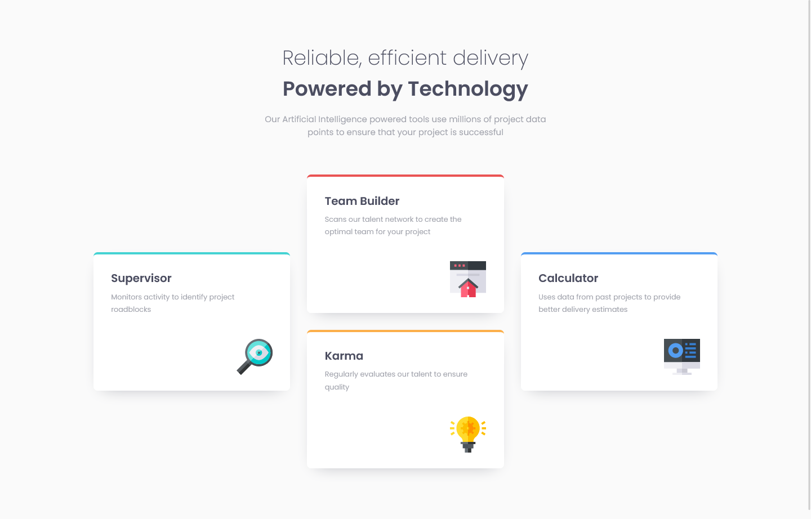

# Frontend Mentor - Four card feature section solution

This is a solution to the [Four card feature section challenge on Frontend Mentor](https://www.frontendmentor.io/challenges/four-card-feature-section-weK1eFYK). Frontend Mentor challenges help you improve your coding skills by building realistic projects. 

## Overview

### The challenge

Users should be able to:

- View the optimal layout for the site depending on their device's screen size

### Screenshot

### Links

- Solution URL: [GitHub repository](https://github.com/Whiskydog/frontendmentor-four-card-feature-section)
- Live Site URL: [GitHub Pages site](https://whiskydog.github.io/frontendmentor-four-card-feature-section/)

## Built with

- Semantic HTML5 markup
- CSS custom properties
- Flexbox
- Mobile-first workflow

## Author

- Website - [Whiskydog GitHub Pages site](https://whiskydog.github.io)
- Frontend Mentor - [@Whiskydog](https://www.frontendmentor.io/profile/Whiskydog)
- Twitter - [@whiskydog](https://www.twitter.com/whiskydog)